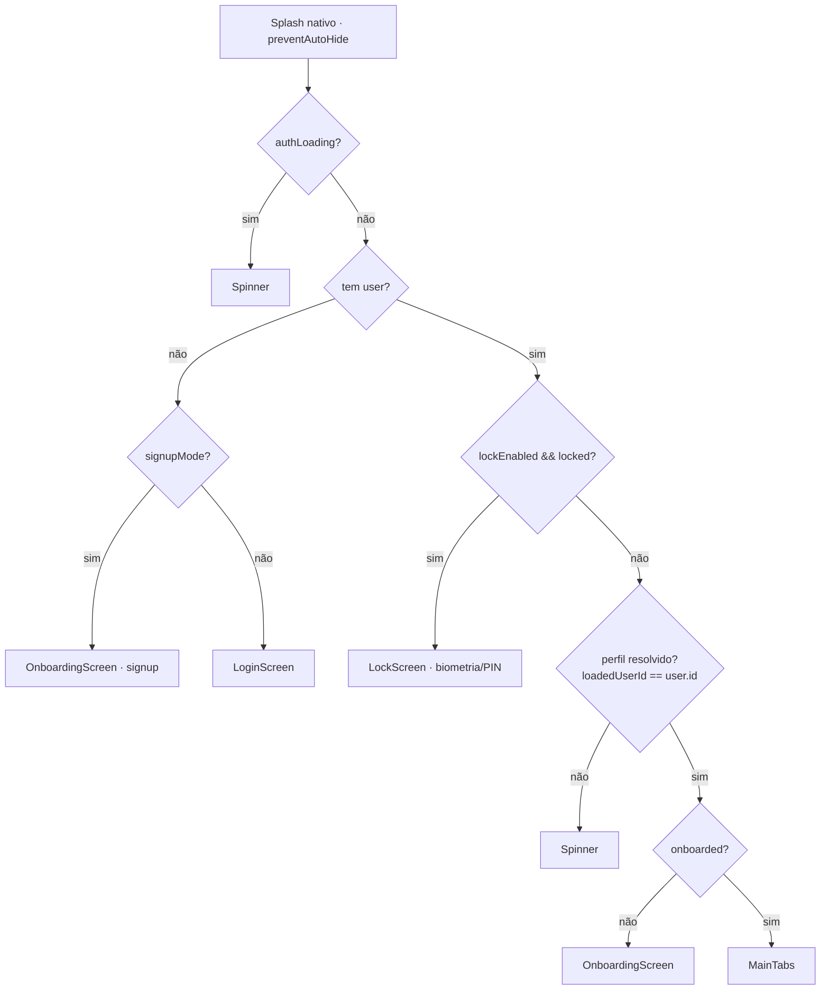
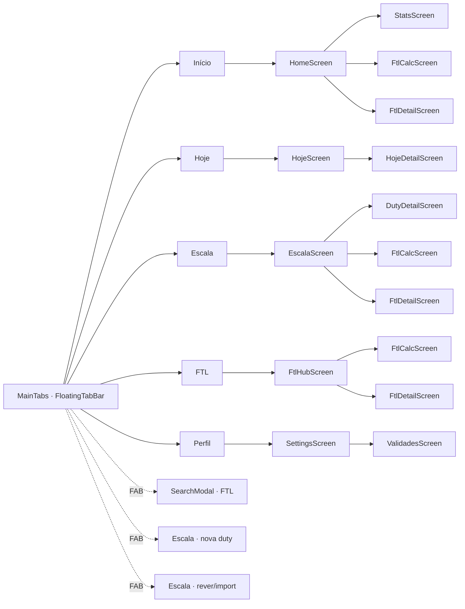
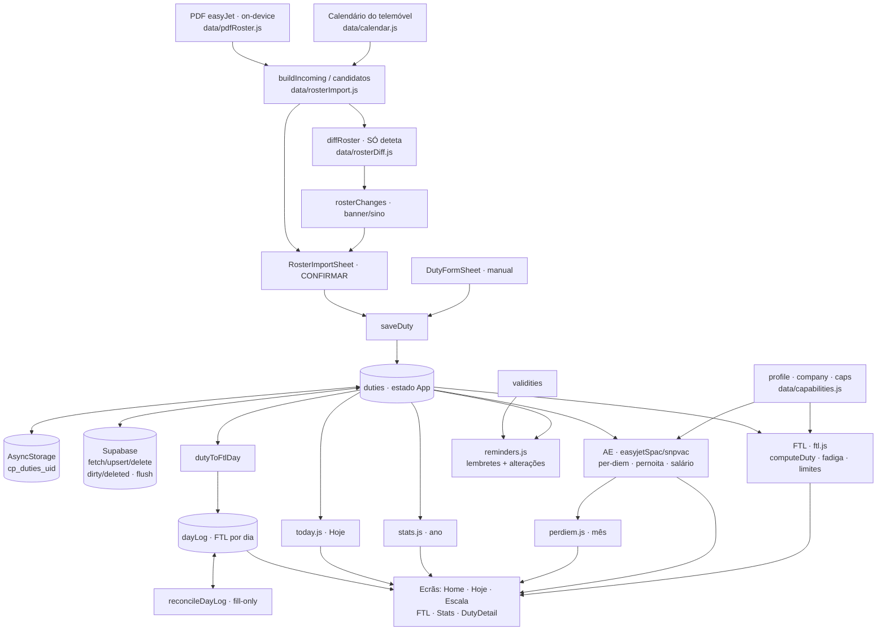

# CrewPact — Arquitetura (fluxogramas)

App React Native / Expo para tripulação easyJet. FTL/AE determinísticos (sem AI),
offline-first, € sempre com cêntimos, PDF on-device (RGPD).

Os diagramas são [Mermaid](https://mermaid.js.org/) — renderizam no preview de Markdown
do VSCode (e no GitHub).

---

## 1. Arranque & gates de acesso

Lógica de `renderScreen()` + splash nativo (`App.js`).

---

## 2. Navegação — 5 abas + stacks

`MainTabs` com `FloatingTabBar` (dock escuro + FAB speed-dial).

Folhas/modais (montados nos ecrãs, não no navigator): `RosterImportSheet`,
`DutyFormSheet`, `CalendarPickerSheet`, `NotificationsBell` (sino), `ConfirmDialog`,
`CenterDialog`, `BottomSheet`.

---

## 3. Pipeline de dados — o coração

Calendário/PDF → **confirmar** → `duties` (offline-first) → motores determinísticos → ecrãs.

---

## Princípios que o fluxo respeita

- **Deteta → confirma → grava.** `checkRosterChanges` SÓ deteta; nada entra no `duties`
  sem confirmação do utilizador (no `RosterImportSheet`).
- **Prioridade do calendário = serviços REAIS.** Se existir um **serviço** no calendário
  num dia → **sobrepõe e substitui (apaga)** o manual/PDF desse dia (selo *"Substitui o
  teu manual"*, ao confirmar). O manual/PDF só **sobrevive** quando o dia está **vazio**
  no calendário (a ausência não apaga). Um evento **OFF/folga** no calendário **não conta
  como serviço** → não substitui o manual. (`data/rosterDiff.js`: `removed` só atinge
  `source==='calendar'`.)
- **Apagar SÓ nos manuais.** Duties de calendário/PDF não se apagam na app — cancelam-se
  pela própria fonte (chegam como `removed`/"cancelada" no import). Resolve a ressurreição.
- **Folga = derivada.** Um dia sem serviço é folga na vista; nunca é guardado.
- **Offline-first.** `saveDuty` escreve local + `dirty`; o flush sincroniza best-effort com
  o Supabase (pendentes locais vencem o servidor até serem enviados).
- **Motores 100% determinísticos** (FTL · AE), sem AI; consultivos/factuais.
- **€ sempre com cêntimos**, nunca arredonda.
- **PDF on-device** (extração local, apaga a cópia) — RGPD; crew nunca extraído.
